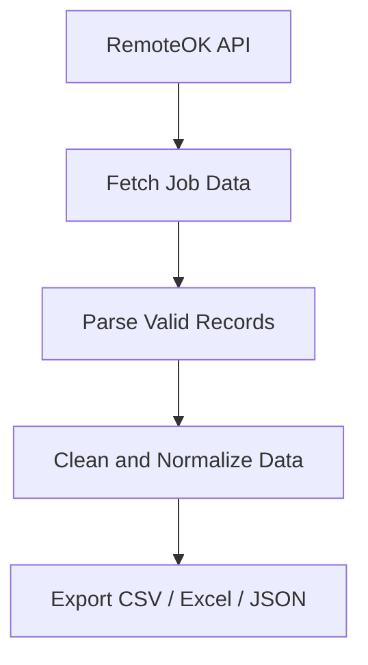
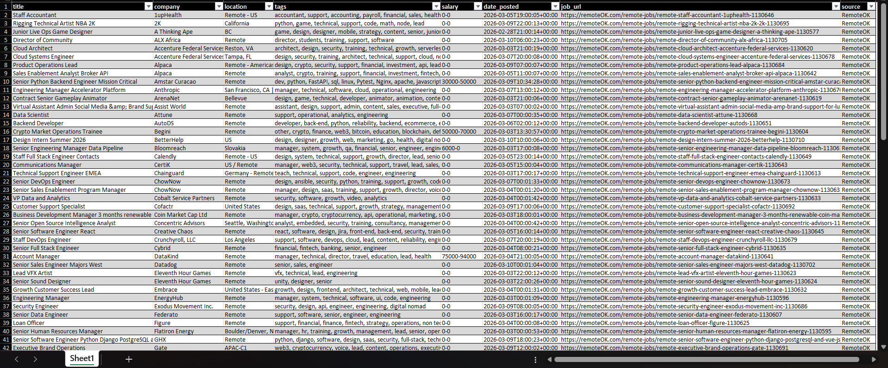

# 🌍 Remote Jobs Data Scraper

> Production-style Python data pipeline that collects remote jobs from RemoteOK, cleans the dataset, and exports ready-to-use analytics files.

[](https://www.python.org/)  
[](LICENSE)  
[](#quality-checks)

---

# ✨ Overview

Remote Jobs Data Scraper is a lightweight ETL-style data pipeline designed on:

- Fetching live job data from `https://remoteok.com/api`
- Parsing only valid job postings
- Cleaning and normalizing fields with a fixed schema
- Removing duplicates deterministically
- Exporting data to CSV, Excel, and JSON

---

# 🔄 Data Pipeline



---

# 🖼 Screenshot



---

# 🖥 Example Run

```text
$ python main.py

Records fetched: 101
Jobs parsed: 100
Raw rows: 100
Clean rows: 100

Pipeline completed successfully.
```

---

# 🚀 Features

| Feature | Description |
|-------|-------------|
| API Scraping | Retrieves jobs from RemoteOK using configurable timeout and headers |
| Robust Parsing | Skips metadata/invalid rows and keeps valid records only |
| Salary Normalization | Maps `salary_min` / `salary_max` and treats `0-0` as missing salary |
| Data Cleaning | Trims text values, fills defaults, and enforces a stable schema |
| Deduplication | Removes duplicates by `title + company + job_url` |
| Multi-format Export | Writes raw CSV, clean CSV, Excel, and JSON outputs |
| Environment Config | Supports `.env` values for `USER_AGENT` and `REQUEST_TIMEOUT` |
| Testing | Includes pytest tests for scraper, parser, cleaner, and config |

---

# 🏗 Architecture

```text
remote-jobs-data-scraper/
├── data/
│   ├── raw/
│   │   └── jobs_raw.csv
│   └── processed/
│       └── remote_jobs_clean.csv
├── images/
│   └── excel.png
├── output/
│   ├── remote_jobs.xlsx
│   └── remote_jobs.json
├── src/
│   ├── __init__.py
│   ├── config.py
│   ├── scraper.py
│   ├── parser.py
│   ├── models.py
│   ├── cleaner.py
│   ├── exporter.py
│   └── pipeline.py
├── tests/
│   ├── test_config.py
│   ├── test_scraper.py
│   ├── test_parser.py
│   └── test_cleaner.py
├── main.py
├── requirements.txt
├── .env.example
├── README.md
└── LICENSE
```

---

# 🧠 Architecture Principles

### Configuration First

Runtime settings are centralized in `src/config.py` and can be overridden with `.env`.

---

### Single Responsibility Modules

- `scraper.py`: API request and response validation
- `parser.py`: field extraction and normalization
- `cleaner.py`: DataFrame cleaning and deduplication
- `exporter.py`: file exports
- `pipeline.py`: end-to-end orchestration

---

### Deterministic Output Schema

The cleaned dataset always follows:

```text
title, company, location, tags, salary, date_posted, job_url, source
```

---

# 💼 Data Logic

### Salary Mapping Rule

```text
if salary_min == 0 and salary_max == 0: null
if both exist and not both zero: "min-max"
if only one exists and is not zero: "value"
otherwise: null
```

### Duplicate Handling

```text
title + company + job_url
```

---

# 📊 Outputs

Running the pipeline generates:

- `data/raw/jobs_raw.csv`
- `data/processed/remote_jobs_clean.csv`
- `output/remote_jobs.xlsx`
- `output/remote_jobs.json`

---

# ⚙️ Setup & Run

### Installation

```bash
pip install -r requirements.txt
```

Optional `.env` file:

```bash
copy .env.example .env
```

`.env` keys:

- `USER_AGENT`
- `REQUEST_TIMEOUT`

### Run

```bash
python main.py
```

---

# 🧪 Quality Checks

```bash
pytest -q
```

---

# 🧰 Technical Stack

- Python 3.10+
- requests
- pandas
- openpyxl
- python-dotenv
- pytest

---

# 👨‍💻 Author

**Lautaro Cuello**

Python Developer  
GitHub:  
https://github.com/Lautarocuello98

---

# 📄 License

This project is licensed under the MIT License.

See `LICENSE` for details.

---

⭐ If you found this project useful, consider giving this repository a star.
